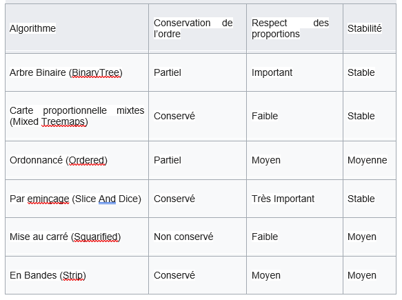
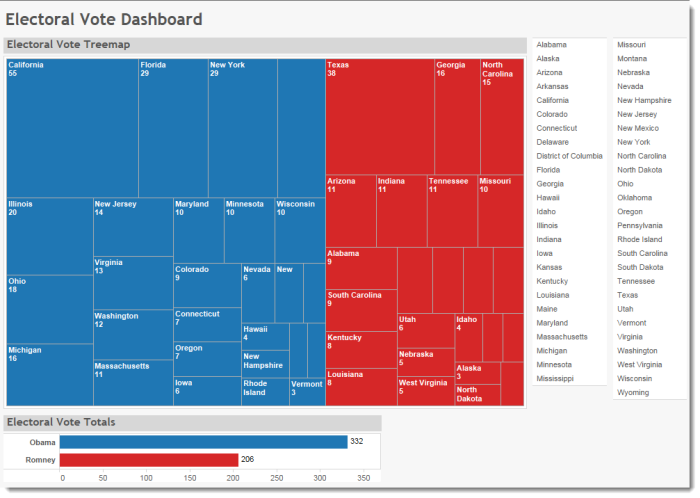
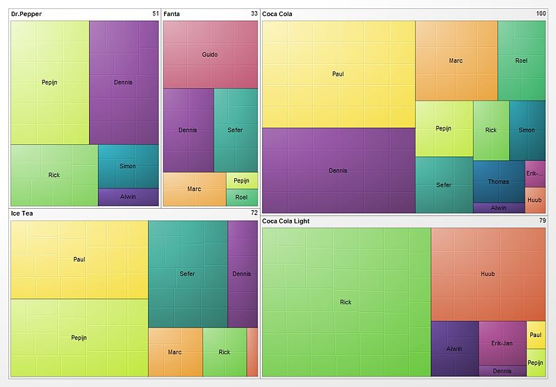
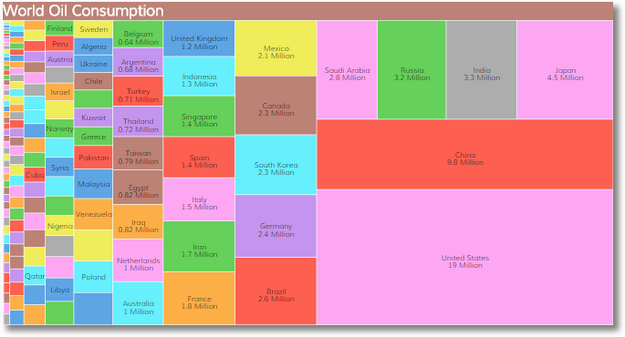

## Treemap

# Information sur le Treemap

Aussi appelé « Carte Proportionnelle », un TreeMap est la représentation de données hiérarchiques dans un espace limité divisé en rectangles auxquels une taille et un ordre sont assignés en fonction d’une variable quantitative. Cette technique de visualisation d'information est construite à partir d’un « Tree Diagram » et permet à l'utilisateur final de reconnaître facilement des motifs graphiques pouvant traduire des relations complexes au sein des données, relations difficiles à déceler autrement.

Les différents niveaux hiérarchiques son visualisées comme rectangles dedans autres rectangles. Chaque conjoint représente soit une colonne soit une expression d’un tableau de données. Chaque rectangle individuel d’un niveau hiérarchique représente une catégorie d’une colonne et sa quantité fixe la taille de son are en proportion avec les autres quantités qui appartient au même père de l’arbre.

Quand une catégorie n’a pas une quantité assignée l’are est distribué de façon équitable entre toutes les catégories qui appartient au même père de l’arbre.

Pour créer une carte proportionnelle, il faut définir un algorithme d’assemblage pour diviser un rectangle en sous-rectangles avec des surfaces définies. Dans l’idéal, un algorithme de carte proportionnelle devrait créer des rectangles de proportions similaires, tout en préservant la signification de l’ordre de données représentées, et toute modification devrait refléter les modifications de ces données.
Malheureusement ces propriétés s'opposent : tandis que les proportions sont optimisées, l’ordre de placement devient en moins prévisible. Tandis que l’ordre est préservé, les proportions entre les rectangles sont dégradées.

À ce jour six principaux algorithmes de carte proportionnelle rectangulaire ont été développés :

<table border="0">
  <tr>
    <td>
      
    </td>
  </tr>
</table>

# Applications d’un Treemap:

Un Treemap est principalement utilisé pour monter information hiérarchique laquelle put être représenté en utilisant l’structure d’arbre. Il est souvent utilisé pour étudier les modèles et occurrences d’une large base de données en utilisant les couleurs et la taille de façon corrélé.

Pour pouvoir employer cette méthode l’information doit être structuré et avoir seulement une élément raisin.

#Aspects importants :

Tiling : processus de diviser grands rectangles en rectangles plus petits. De façon idéale l’aspect ratio des rectangles sera proche à un. Mais, c’est aussi important à tenir en compte la relation inverse entre l’ordre et l’aspect ratio.

Aspect Ratio : quand il a une valeur haute les rectangles devient assez minces et difficiles à comparer. Pour cette raison on cherche à avoir une valeur proche à un.

# Exemples

<table border="0">
  <tr>
    <td>
      
    </td>
  </tr>
</table>

<table border="0">
  <tr>
    <td>
      
    </td>
  </tr>
</table>

<table border="0">
  <tr>
    <td>
      
    </td>
  </tr>
</table>

# Sources

https://fr.wikipedia.org/wiki/Treemap

https://docs.tibco.com/pub/spotfire_web_player/6.0.0-november-2013/es-ES/WebHelp/GUID-F3F4ABDF-8418-42D3-A1C4-60B7A8121C75.html

https://datavizcatalogue.com/methods/treemap.html

https://www.fusioncharts.com/dev/chart-guide/treemap/introducing-the-treemap.html

https://en.wikipedia.org/wiki/Treemapping#/media/File:Gradient_grouped_treemap.jpg

http://www.datarevelations.com/2015

https://www.kaushik.net/avinash/data-visualization-inspiration-analysis-insights-action-faster/
